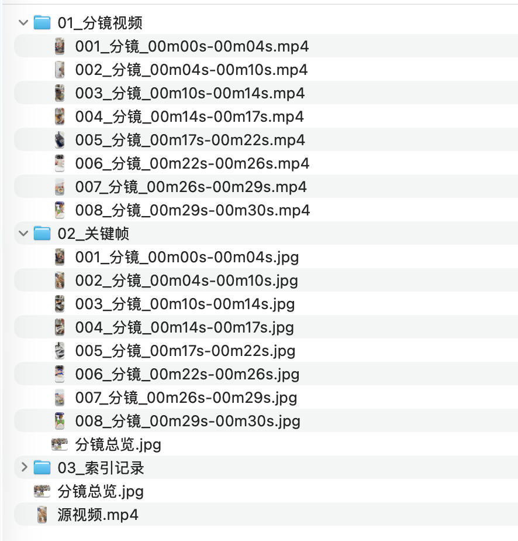

# TikTok Video Splitter

[](https://github.com/Jason8888x8888/tiktok-video-splitter/actions/workflows/ci.yml)
[](https://github.com/Jason8888x8888/tiktok-video-splitter/releases)
[](LICENSE)
[](https://www.python.org/)

把用户明确提供的一条 TikTok 视频或本地 MP4 拆成连续物理分镜，并生成同名关键帧、总览图、CSV 与可追溯 JSON。默认全程本地、零 Token；只有用户明确授权上传和费用时，才使用模型逐镜补充语义名称。

## 安装

从 GitHub 一行安装：

```bash
npx skills add Jason8888x8888/tiktok-video-splitter
```

本地开发安装：

```bash
git clone https://github.com/Jason8888x8888/tiktok-video-splitter.git
cd tiktok-video-splitter
npx skills add .
```

确认 Skill 可被发现：

```bash
npx skills add . --list
```

## 产物示例



```text
视频拆解-示例视频-1234567890-2026-09-01/
├── 源视频.mp4
├── 分镜总览.jpg
├── 01_分镜视频/
├── 02_关键帧/
│   └── 分镜总览.jpg
└── 03_索引记录/
    ├── candidates.json
    ├── 分镜资产清单.csv
    ├── segments.json
    ├── download-summary.json
    └── run-summary.json
```

运行摘要会记录场景事件、自动调参证据、人工复核建议、工具版本、输入哈希、Token 使用和失败阶段。结构校验通过不代表语义已经人工核验。

## 前置条件

- Python 3.10+
- FFmpeg 与 FFprobe
- yt-dlp：仅处理 TikTok URL 时需要
- curl 与 Ark API Key：仅 `hybrid` 语义模式需要

macOS 可通过 `brew install ffmpeg` 安装 FFmpeg；Ubuntu 可运行 `sudo apt-get install ffmpeg`。yt-dlp 请参考其[官方安装说明](https://github.com/yt-dlp/yt-dlp/wiki/Installation)。

## 快速开始

先做只读预检；它不会下载、上传或创建输出目录：

```bash
python3 scripts/assetize_tiktok.py "/absolute/path/video.mp4" \
  --output-parent "/absolute/path/output" \
  --validate-only
```

本地零 Token 拆解：

```bash
python3 scripts/assetize_tiktok.py "/absolute/path/video.mp4" \
  --output-parent "/absolute/path/output" \
  --mode local
```

也可把输入替换为一条用户明确提供的 TikTok HTTPS URL。默认 `--scene-threshold auto` 先做本地预扫描，再根据真实转场密度选择阈值与最短分镜；它不会上传视频。该策略是启发式判断，异常素材应检查总览图并改用 `--scene-threshold 0.30` 等手动数值。

## AI 语义模式

```bash
python3 scripts/assetize_tiktok.py "/absolute/path/video.mp4" \
  --output-parent "/absolute/path/output" \
  --mode hybrid \
  --api-key-file "/absolute/path/ark-key.txt"
```

`hybrid` 会上传完整视频并产生费用，必须先取得用户对本次上传和费用的明确授权。模型只能逐镜命名，不能合并、拆分、重排或修改物理边界。默认上传上限为 200 MiB；provider 未返回 Token usage 时记录为 `unknown`。

## 触发边界

适用请求：物理分镜、视频切片、混剪素材整理、关键帧与索引生成。

不适用：只下载、账号监控、批量抓取、固定时长机械切割、字幕/逐字稿、叙事分析、CapCut 草稿写入和最终成片剪辑。

## 安全与隐私

- yt-dlp 强制 `--ignore-config`，不继承用户全局下载参数。
- 外部子进程使用最小环境变量，不继承 Ark API Key。
- 来源 URL 会移除查询参数、片段和嵌入式凭据；错误信息会脱敏本地路径和密钥。
- Cookie 只在用户明确授权后使用，Skill 不读取、记录或转述 Cookie 内容。
- 最终输出与 `.partial` 默认拒绝覆盖；恢复渲染也必须显式使用 `--replace-assets`。
- 下载流程不会绕过登录、地区、验证码、访问控制或平台限制。

安全问题请按 [SECURITY.md](SECURITY.md) 私密报告，不要在公开 Issue 中提交凭据、用户数据或真实视频路径。

## 输出兼容性

分镜视频使用 MP4/H.264/yuv420p；存在音频时使用 AAC。这表示“剪映/CapCut 兼容编码配置”，不代表已写入 CapCut 草稿或通过真实编辑器导入认证。

## 故障排查

| 问题 | 处理方法 |
|---|---|
| 预检返回 `status=invalid` | 查看 `checks` 中 `required=true` 且 `ok=false` 的项目。 |
| TikTok 下载失败 | 更新 yt-dlp 并确认链接可访问；项目不会绕过平台限制。 |
| 出现 `.partial` | 读取 `03_索引记录/run-summary.json` 的 `stage`、`recoverable` 和 `next_action`。 |
| `events_truncated=true` | 检查总览图并人工复核，必要时显式调整 `--max-scene-events`。 |
| 分镜过密或过疏 | 检查自动调参证据，再显式设置 `--scene-threshold` 或 `--min-shot-seconds`。 |

## English Quick Start

TikTok Video Splitter turns one user-provided TikTok video or local MP4 into contiguous physical shots, matching keyframes, an overview image, CSV, and versioned JSON indexes. Local mode is offline and uses zero model tokens.

```bash
npx skills add Jason8888x8888/tiktok-video-splitter
python3 scripts/assetize_tiktok.py "/absolute/path/video.mp4" \
  --output-parent "/absolute/path/output" \
  --mode local
```

Use `--validate-only` first. Hybrid mode uploads the complete video and may incur provider charges, so run it only after explicit user authorization. See [SKILL.md](SKILL.md) for the full capability and safety contract.

## 开发与验证

```bash
PYTHONDONTWRITEBYTECODE=1 python3 -m unittest discover -s tests -v
python3 scripts/verify_release.py
```

CI 在 Python 3.10 和 3.12 上运行单元测试、真实 FFmpeg 合成视频端到端回归和发布包验证。代码只依赖 Python 标准库；媒体运行时依赖记录在 [requirements.txt](requirements.txt)。

## 项目状态

当前版本：`0.1.0-beta.3`（公开 Beta）。

自动化本地链路已有合成视频证据。真实 TikTok 下载会受平台和 yt-dlp 变化影响；provider-backed hybrid 质量基准、真实 CapCut 导入、独立人工评审与生产遥测仍标记为 `missing evidence`，不是 `v1.0.0` 完成项。

## 责任边界与商标

只处理你拥有、获授权或依法可处理的内容。使用者负责遵守适用法律、平台条款、隐私要求与第三方权利。本项目不提供访问控制绕过能力，也不鼓励未经授权的下载或再发布。

本项目与 TikTok、ByteDance、CapCut 或 Volcengine 无隶属、赞助或背书关系；相关名称和商标归其各自权利人所有。

## 致谢

- [yt-dlp](https://github.com/yt-dlp/yt-dlp)：链接下载与元数据解析。
- [FFmpeg](https://ffmpeg.org/)：场景检测、转码、抽帧与总览生成。
- [Volcengine Ark](https://www.volcengine.com/docs/82379)：可选语义标注服务。
- [Agent Skills](https://agentskills.io/)：Skill 包格式。

## 许可证

[MIT](LICENSE)
